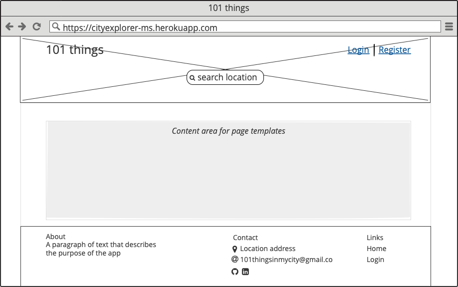
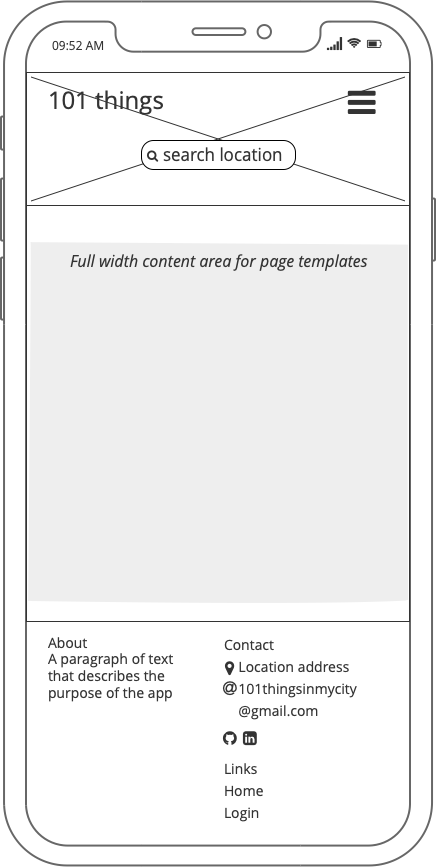
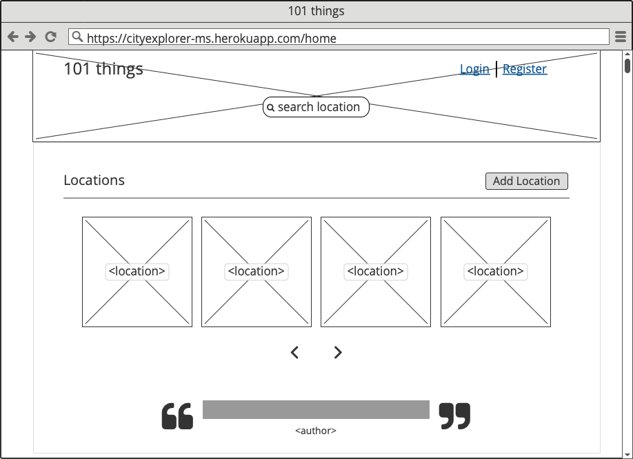
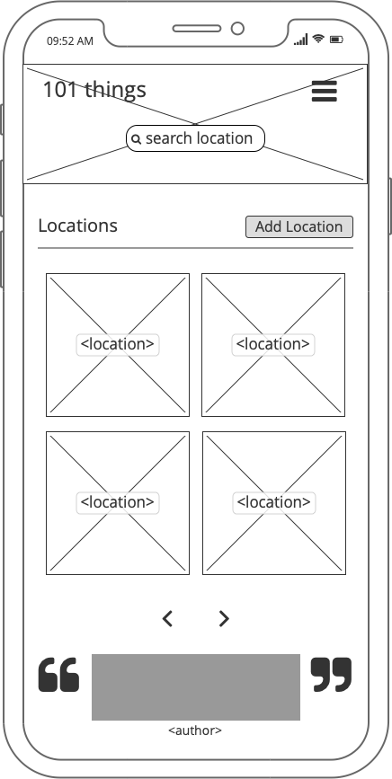
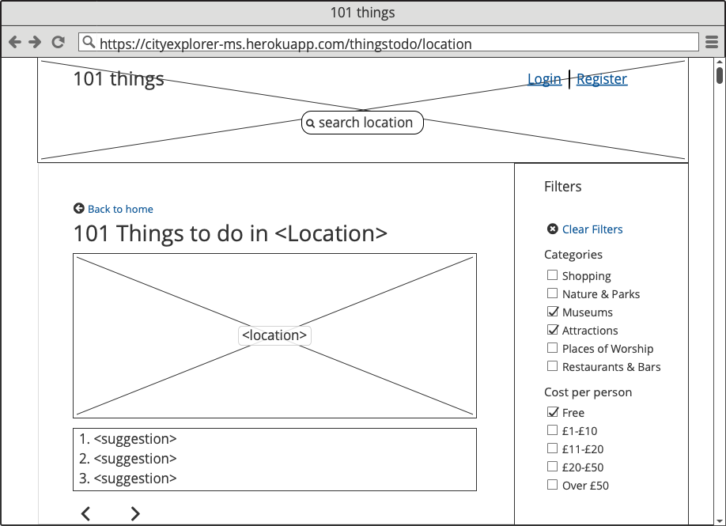
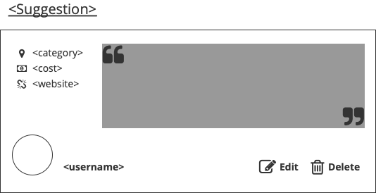
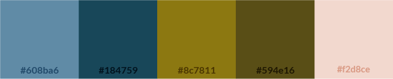

 

 
 

# Table of contents
1. [Introduction](#introduction)
    * [Objective](#objective)
    * [User stories](#users)
    * [Wireframes](#wireframes)
    * [Design Notes](#design)
2. [UX](#design)
3. [Features](#features)
    * [Existing Features](#existing_feat)
    * [Features left to implment](#future_feat)
4. [Information Architecture](#models)
    * [Users](#users)
    * [Cities](#cities)
5. [Technologies Used](#technologies)
6. [Testing](#testing)
7. [Deployment](#deployment)
8. [Credits](#credits)
    * [Content](#content)
    * [Media](#media)
    * [Acknowledgements](#acknowledgements)

## Introduction 

#### Objective 
+ The focus of this project is to create a platform for adventurers to share their good experiences of their local area with other travellers in the community who would benefit from the local knowledge and advice. 
+ The app is designed for people who love to travel and explore. The colour themes will be inspired by the earth/globe.

Visit 101 Things [here](https://cityexplorer-ms.herokuapp.com/) 

#### User Stories 
"As a user, I would like to ___________"
+ Add my location to the app
+ Add suggestions to the list
+ Search for a city in the app
+ Browse suggestions by all users for a location
+ Find all free things to do in a city
+ View all my own suggestions
+ Edit my suggestion
+ Find all suggestions that are Museums

#### Wireframes 
+ The navigation bar will be contained within the header and will have a transparent background so that the so that the hero-image in the header is visible beneath.
+ The header will contain the search bar so it accessible on whichever page the user has navigated to.
+ The content section is where the page templates are displayed. All templates will have a top margin of 50px to space it from the header.
+ The footer has a 'sticky' position so that even if the content does not fill the viewport height, the footer will remain anchored at the bottom of the screen.

Display on large screens:   
  

Display on mobile devices:   
  

+ The home page will display all the locations in the database as cards and will also contain image backgrounds to add colour to the page
+ A animated reel looping through all the user suggestions will be displayed on the home page as example posts.
+ A button invites users to add location to the database if it doesn't already exist
+ Any searches made will direct to the home page and the location card that matches the search will be displayed
+ If no results in a search are found, the home page sontent is replace by a "No results found message"
+ Admin users will be able to see links on the cards that enable them to change the location's associated image or delete the location from the database

Home template for large screens:   
  

Home template for mobile screens:   
  

An admin user view:   
  

+ The thingstodo page will display all the suggestions that have been added for the selected location
+ A filter form allows the results to be refined. When any of the checkboxes are checked, the page updates the results automatically.
+ Once filters are applied, the selected filters are displayed in a list and can be cleared on the click on a link
+ Pagination limits the number of results per page and provides links to the next set of results.
+ The suggestions can be clicked to expand the result and display the information provided by the user author. 
+ If no cost or url provided, the field is left blank
+ Any admin user, or author of the selected content can edit or delete the suggestion record
+ If a user posted a suggestion but since deleted their account, the roundel displaying their profile picture is replaced with a default picture

Thingstodo template for large screens:   
  

Home template for mobile screens:   
  

Layout of expanded content showing admin and author view (with edit and delete buttons):   
  

#### Design 
+ The design is intended to feel modern but warm and traditional. It uses earth tones inspired by travel. 

Colours used in the desing:   
  

+ The colour pallette used in the app add warmth and comfort.
+ Font Awesome icons are employed as visual cues to help make the UI as intuitive as possible. It is important that these are used in moderation so that they do not become distracting. 

##### Typography
+ The fonts chosen for this project are <b>"Patua One,"</b> <b>"Lato"</b> and <b>"EB Garamond."</b> from google fonts
+ Patua One is used for the logo and top level headings and for the location card. It's serifs are traditional
+ Any quoted data such as the searched input returned in the 'no results found' message is written in EB Garamond italic. This serif font is traditional and elegant and compliments Patua One.

## Features 
#### Existing Features 
+ User Login
    + A user can register an account which allows them to create locations or add suggestions for a location.
    + If a user is already logged in, the login page redirects them to the home page
    + If a user is trying to access a restricted feature, they are redirected to the login page
    + Once their credentials have been verified, the user is directed on to the page they were trying to access, or to the home page

+ Accout Page and Management
    + The user account page enables a user to update their account details
    + Any suggestions that the user has contributed are listed in their account page with buttons to edit or delete the record
    + The user can upload an a profile picture that will be displayed against any suggestions that they contribute. They can update this picture anytime.
    + Users can delete their account and it will remove their record from the database. This will not affect the posts that they have made which will still credit them as authors
    + A user can request their password to be reset by clicking on 'Forgot Password' in the Login Template and providing their email address. This sends out an email containing a reset password token.
    + For security, the token expires if not used straight away and the user must send a new request 

+ Add Location 
    + A user can add a location to the app if they are logged in
    + The form takes the location name 
    + Submitting the location redirects the to immediate add a suggestion to the record
    + The form validates if a location already exists and returns an error message to the user

+ Add a Suggestion
    + A user can provide a suggestion for any existing location if they are logged in
    + The suggestion title and category are required fields. The url field verifies if the input is a correct url format.

+ Edit Suggestion
    + Editing suggestions is a feature reserved for admin users or the author of the suggestion
    + Opens up a modal with the form inside. The fields are prefilled with the current data for the suggestion record.
    + All fields except for the suggestion title can be edited. This is so that the suggestion cannot be completely swapped to sometihng completely different. 

+ Search for a Location
    + The search form is located in the Header which means it can accessed and submitted from anywhere in the app.
    + The search box has rounded corners and responds to being hovered over or focused by extending in length.

+ Filters
    + The thingstodo template contains a filter results form with 2 fields containig a list of checkboxes. The page responds to any checkbox being checked or unchecked and adds or removes the filter accordingly. 
    + Multiple choices within the same field, returns results that either _choice 1_ or _choice 2_ etc.
    + Choices from the two different form fileds filter results that correspond to _choice 1_ and _choice 2_.

+ Admin User
    + An admin account is able to view reserved buttons for each location on the home page. The image button allows them to provide or update a picture for the location. The Remove button allows them to delete the location from the database

+ Protection against empty Locations
    + If a user creates a Location they are directed to add a suggestion straight away. If they navigate away from this form without submitting it, the location is removed from the database so as not to hold documents with no 'things to do' data.
    + Similarly, if a user deletes all their suggestions from the 'things to do' list and leaves the list empty, the location will be deleted when the home page is rendered.
    + The 

#### Features Left to Implement 
+ Users to upload pictures related to the suggestions contributed
+ User Ratings for suggestions so that the top rated 101 suggestions are listed

## Information Architecture  
#### Users Collection 

    "users": {
        "username": "<string",
        "fname": "<string",
        "lname": "<string",
        "email": "<string",
        "password": "<string",
        "picture": "<string",
        "is_admin": "<boolean>",
    }

#### Cities Collecion 

    "cities": {
        "_id": "<ObjectId>",
        "location": "<string>"
        "thingstodo": [
            {
                "suggestion": "<string",
                "category": "<string",
                "cost": "<string",
                "url": "<string",
                "comment": "<string",
                "author": "<string",
            }
        ]
        "bg_img": "<string>"
    }

## Technologies Used 
#### Frontend:
+ HTML5, CSS3, Javascript
    + Frontend programming languages
+ [JQuery 3.5.1](https://jquery.com/)
    + Simplifies access and manipluation of the DOM
    + Used to load more/show less results in the filter results form
    + Used to fade in/out of each suggestion in loop on home page
+ [Bootstrap 4.5](https://getbootstrap.com/)
    + Provides the visual formatting of the website and it's responsiveness accross all devices
    + Made use of the layout containers and components to keep consistency in templates

#### Backend:
+ [Python 3,7](https://www.python.org/downloads/release/python-370/)
    + For processing all backend logic
+ [Flask](https://flask.palletsprojects.com/en/1.1.x/)
    + The web application framework that provided many of the extensions used in this project
    + flask-paginate provided pagination of results
    + flask login manages the 
+ [MongoDB](https://www.mongodb.com/)
    + Provides the NoSQL database for the app

#### Other:
+ [Visual Studio Code](https://code.visualstudio.com/)
    + The IDE that facilitated the devlopment of this project.
+ [GitHub](https://github.com/)
    + The platform where the project code is stored remotely
+ [Heroku](https://heroku.com/)
    + For deployment of the app
+ [Balsamiq](https://balsamiq.com/wireframes/)
    + For the creation of the wireframes used in this project

## Testing 
#### Validators

The following services were used to check the web code:

+ HTML
    + [W3C Markup Validation](https://validator.w3.org/)
+ CSS
    + [CSS Lint](http://csslint.net/)
+ Javascript
    + [Javascript Lint](https://jshint.com/)
+ Python
    + [Pylint]()  
    In the \_\_init__.py file,  the following line of code is placed at the bottom of the file and therefore flags as an error:  <pre><code>from cityexplorer import routes</code></pre>
    This deliberate action was taken because the line is not necessary to the views in \_\_init__.py and is just to ensure that module is imported. The routes.py file depends on \_\_init__.py and so it is a circular import.

#### Manual
These were the manual tests performed and passed:

#### Known bugs

## Deployment 
#### Remote
The following steps were taken to deploy the project to Heroku where <b>101 things</b> is hosted:

1. From within Github, navigate to fdeboo/simon
2. Select the Settings tab from the menu, found beneath the repository name 
3. Scroll down to the GitHib Pages section.
4. Under 'Source', choose 'Master Branch' from the dropdown menu
5. The page will automatically refresh and the site is deployed
6. A link to the live site is provided

#### Local
1. To run this project locally, navigate to the repository on github [here](https://github.com/fdeboo/101things)
2. Click on the green "Clone or Download" button
3. Copy the URL from the dropdown
4. In your local IDE, open the terminal ensure the current working directory is set to where you want the clone to be created
5. Type <code>git clone</code> and then paste the copied link: <pre><code>git clone https://github.com/fdeboo/101things</code></pre>
6. Press enter. This completes the deployment.
7. Create a MongoDB account.
8. Reproduce collections as per [Information Architecture](#models)
9. Create a Cloudinary account for storing images
10. Install pipenv by typing <code> brew pipenv </code>
11. Create virtual environment <code> pipenv shell </code>

## Credits 

#### Content 
All paragraph text and content was written by me.

#### Media  
##### Images
+ The images used in this project were sourced from [Pexels.com](https://www.pexels.com/)

#### Acknowledgements 
Special thanks to, 
+ Mentor Aaron Sinott
+ [GBrachetta](https://github.com/GBrachetta) for getting me going on this project with his advice and recomendations.